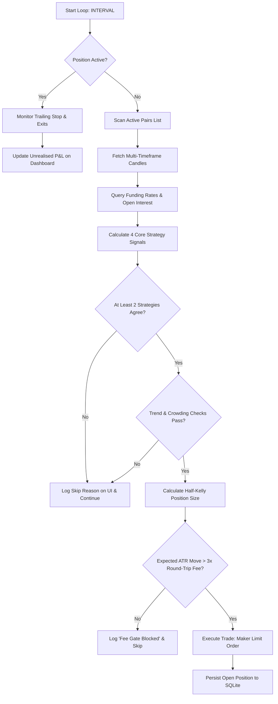

# ⚡ Binance Professional Quantitative Trading Bot
### Asynchronous, Self-Learning, 24/7 Autonomous Futures Trading System
[](https://opensource.org/licenses/MIT)
[](https://www.python.org/downloads/)
[]()
[]()

An advanced, fee-aware, milestone-based compounding trading system built on Binance Futures. Designed to compound starting capital aggressively into **10x returns** (e.g. $10 → $100, $100 → $1,000) using multi-symbol scanning, dynamic signal weights, and institutional-grade risk gates.

---

## 🧭 System Decision Flow



---

## 🚀 Key Features

*   **Multi-Symbol Scan Engine**: Iterates across active volatile trading pairs (e.g. `BTCUSDT`, `ETHUSDT`, `SOLUSDT`, `XRPUSDT`) to find trade setups quickly and boost performance data logs.
*   **2-Strategy Confluence Rule**: Never flies blind. The bot requires at least 2 distinct strategies to agree on direction, filtered by the 1h macro trend and derivatives crowding metrics.
*   **Self-Learning Weight Engine**: SQLite-backed temporal learning. Tracks win rates per indicator hourly (0-23 UTC) and adjusts weights dynamically every 20 trades.
*   **Real-time Glassmorphic UI Dashboard**: Switch between **Paper Trading** (Test mode) and **Live Trading** with a single click. Displays active metrics, open position details, holding timers, strategy win rates, and logs.
*   **Zero Fee Bleeding Gate (Fee Guardian)**: Automatically skips signals if expected ATR volatility moves are less than 3x the round-trip commission fee costs.
*   **Triple-Layer Drawdown Circuit Breakers**:
    *   **Daily Drawdown**: Pauses trading for 6 hours if account is down 10% today.
    *   **Weekly Drawdown**: Pauses trading for 24 hours if net loss over the last 7 days exceeds 20%.
    *   **Peak Drawdown**: Pauses trading for 48 hours if account is down 25% from all-time peak balance.
*   **Dynamic Compounding & Milestone Engine**: Reinvests profits automatically, scaling the goal to exactly **10x** the initial balance. Periodically triggers cash payouts (e.g. 10%-15% profit cashout) directly to Telegram.
*   **Maintenance & Event Aware**: Scrapes Binance support announcements via regex. Pauses trading 30 minutes before and during scheduled upgrades, and halves position sizing during high-volatility events.
*   **Telegram Integration**: Sends instant trade entries/exits, daily summary statistics, heartbeats, and circuit breaker alerts to your mobile phone.

---

## 📁 Repository Directory Structure

```
trading-bot/
├── main.py                    # Asynchronous trading loop and watchdog task
├── config.py                  # Environment configurations and strategy multipliers
├── dashboard.py               # Flask API server routing shared memory state
├── run_verifications.py       # Local workspace validation script
├── LICENSE                    # MIT Open-Source license
├── .gitignore                 # Prevents committing credentials or local cache
├── requirements.txt           # Python library dependencies
│
├── modules/
│   ├── alerting.py            # Telegram HTML push messages (alerts and daily summaries)
│   ├── backtester.py          # Weekly historical backtester and weight optimizer
│   ├── circuit_breaker.py     # Drawdown and lockout timers (Daily/Weekly/Peak)
│   ├── compounder.py          # Milestone profit reinvestment payouts
│   ├── event_watcher.py       # Scraper for Binance scheduled maintenance RSS feeds
│   ├── fee_guardian.py        # Volatility ATR-to-fee check gate
│   ├── indicators.py          # Custom technical indicators (VWAP, ADX, StochRSI, OBV)
│   ├── learning_engine.py     # SQLite database migrations and statistical queries
│   ├── position_sizer.py      # Half-Kelly position sizing and minimum notional checks
│   ├── regime_detector.py     # 1h Market phase classification (BULL, BEAR, RANGE, VOLATILE)
│   ├── signals.py             # 4 trading strategies and confluence direction logic
│   └── state.py               # Shared thread-safe state map and log stream handlers
│
└── templates/
    └── dashboard.html         # HTML5 glassmorphic dashboard template
```

---

## 📈 The 4 Core Trading Strategies

| Strategy | Timeframe | Indicators | Description | Stop / Profit Bounds |
|---|---|---|---|---|
| **1. Trend Following** | `15m` / `1h` | EMA 9/21 cross, MACD hist, ADX > 25 | Enters in direction of dominant trend on 15m and 1h. Disabled automatically in `RANGING` markets. | `1.5x ATR` SL / `3.0x ATR` TP |
| **2. Mean Reversion** | `1m` / `15m` | RSI Divergence, BB (20,2), VWAP, StochRSI | Identifies pivot points on overextended prices near Bollinger Bands. Disabled automatically in `HIGH_VOLATILITY` regimes. | `1.0x ATR` SL / `1.5x ATR` TP |
| **3. Volume Breakout** | `15m` | Vol > 2x avg, OBV trend, ATR spike | Catches momentum breakouts early when price breaks 20-period highs/lows with significant volume confirmation. | `1.5x ATR` SL / `4.0x ATR` TP |
| **4. Funding Rate Fade** | Live API | Funding rate extremes, Open Interest change | Contrarian fade strategy. Goes LONG if funding <-0.15% and SHORT if funding >0.15% with rising open interest confirmation. | `1.5x ATR` SL / `3.0x ATR` TP |

---

## 🏆 Sourcing & Sizing Advantages (Why it's Better)

*   **$0 Data Costs**: Standard bots require subscription fees for premium feeds ($50–$300/month for on-chain data, options flow, or sentiment indexes). By using Binance's public REST and Websocket APIs, this system runs with **zero operating cost**, allowing 100% of profit to compound.
*   **Derivatives Alpha**: Unlike retail bots that look only at indicators like RSI, this bot queries derivatives indicators (**Funding Rates** and **Open Interest**) to enter high-probability trades when retail traders are over-leveraged and trapped.
*   **Volatile Asset Arbitrage**: Multi-symbol iteration scans across active contracts. If one coin is consolidating (no signal), it immediately moves on to scan and enter setups on others (e.g. `SOLUSDT` or `XRPUSDT`).

---

## 🛠️ Installation & Setup (New PC)

### Step 1: Install Python
Ensure you have **Python 3.10+** (Python 3.11/3.12 recommended) installed on your system.
*   Download: [python.org/downloads](https://www.python.org/downloads)
*   *Important*: Check the box **"Add Python to PATH"** during installation.

### Step 2: Clone/Download Project
Extract the project folder to your directory. Open your terminal (Command Prompt, PowerShell, or Bash) in that folder:
```bash
cd path/to/trading-bot
```

### Step 3: Install Dependencies
Install all package requirements via `pip`:
```bash
pip install -r requirements.txt
```

### Step 4: Configure Environment Variables
Create a `.env` file in the root folder of the project. **Never share or commit this file!**
```ini
# Binance API Credentials
BINANCE_API_KEY=your_api_key_here
BINANCE_API_SECRET=your_api_secret_here

# Telegram Configuration
TELEGRAM_BOT_TOKEN=your_telegram_bot_token_here
TELEGRAM_CHAT_ID=your_telegram_chat_id_here

# Sizing and Capital
INITIAL_CAPITAL=10.0
USE_TESTNET=true
```

> **How to set up Telegram notifications**:
> 1. Search for `@BotFather` on Telegram and send `/newbot`.
> 2. Copy the **HTTP API Token** and paste it as `TELEGRAM_BOT_TOKEN`.
> 3. Search for `@userinfobot` or `@raw_data_bot` to find your personal Telegram chat ID, and paste it as `TELEGRAM_CHAT_ID`.

---

## 🚀 Running the Bot

1.  **Launch the dashboard and server**:
    ```bash
    python dashboard.py
    ```
2.  **Open your browser** to see the interactive interface:
    ```
    http://localhost:5000
    ```
3.  **Start Trading**:
    *   Select **Paper Trading** (Test mode) to run with simulated accounts, or **Live Account** to trade real USDT.
    *   Click **Start Bot** in the top header.
    *   Observe the **Live Strategy Diagnostic Monitor** panel to watch the bot fetch, evaluate, and detail why signals are taken or skipped.

---

## 📁 VPS Deployment (Ubuntu 22.04 LTS Setup)

To configure the bot to run 24/7 on a cloud VPS with auto-starts on system reboot, configure a systemd daemon service:

1.  **Create a service description file**:
    ```bash
    sudo nano /etc/systemd/system/tradingbot.service
    ```
2.  **Paste the following configuration** (replace paths and user as appropriate):
    ```ini
    [Unit]
    Description=Binance Futures Trading Bot
    After=network.target

    [Service]
    Type=simple
    User=ubuntu
    WorkingDirectory=/home/ubuntu/trading-bot
    ExecStart=/home/ubuntu/trading-bot/venv/bin/python main.py
    Restart=always
    RestartSec=30
    StandardOutput=append:/home/ubuntu/trading-bot/logs/bot.log
    StandardError=append:/home/ubuntu/trading-bot/logs/bot_error.log

    [Install]
    WantedBy=multi-user.target
    ```
3.  **Reload and start the daemon**:
    ```bash
    sudo systemctl daemon-reload
    sudo systemctl enable tradingbot
    sudo systemctl start tradingbot
    ```
4.  **Monitor live logs**:
    ```bash
    journalctl -u tradingbot -f
    ```

---

## ⚖️ License & Open-Source Contributions
This project is open-source under the [MIT License](LICENSE). Contributions, bug reports, and enhancements (e.g. strategy adjustments or visual graphs) are welcome. Please ensure that you never check in your `.env` credentials when opening pull requests.